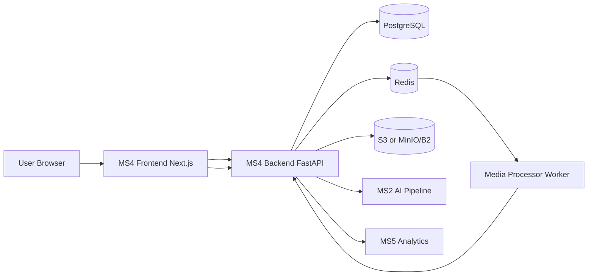
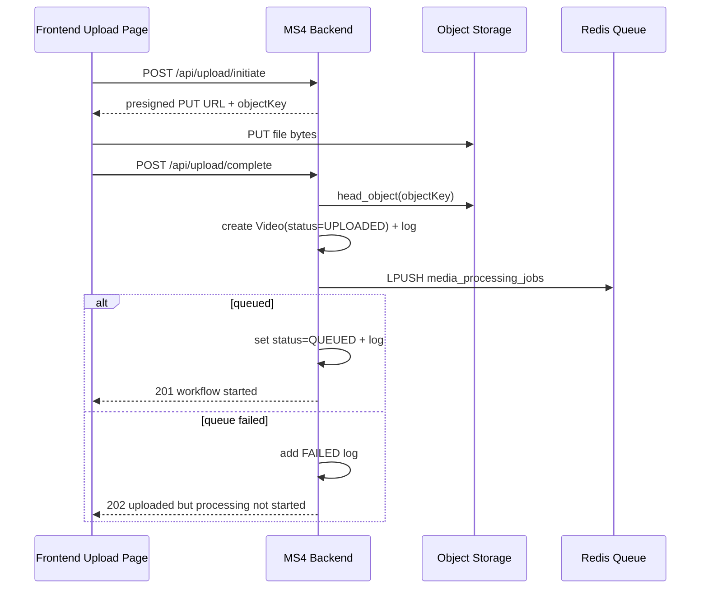

# MS4 End-to-End Workflow

This document explains the complete workflow implemented by MS4 (NeuroStream User Workflow Service), from user authentication to upload, processing orchestration, status callbacks, analytics events, and cleanup.

## 1) Purpose and Boundaries

MS4 is the orchestration layer between the web UI and downstream processing services.

MS4 is responsible for:
- User authentication and identity context
- Signed upload URL generation for direct object storage upload
- Video record creation and workflow status logging
- Queueing work for media processing
- Accepting internal service callbacks to advance workflow state
- Exposing library and video details APIs for the UI
- Forwarding player interaction events to MS5 analytics
- Soft-delete + storage cleanup orchestration

MS4 does not perform heavy media/AI processing itself. It delegates to downstream services (for example media-processor, MS2, MS5, and other cognitive services).

## 2) High-Level Architecture

## 3) Backend Startup and Health

During startup, MS4 backend:
1. Imports SQLAlchemy models so metadata is complete.
2. Runs table auto-creation (`Base.metadata.create_all`).
3. Validates object storage bucket access (`ensure_bucket`).
4. Exposes health endpoints:
   - `GET /health`
   - `GET /`

Core router groups mounted:
- `/auth`
- `/api/upload`
- `/api/videos`
- `/internal`

## 4) Authentication Workflow

Frontend auth pages call:
- `POST /auth/register`
- `POST /auth/login`

Backend behavior:
1. Register creates user record with hashed password.
2. Login verifies password hash.
3. Both return JWT token and user payload.
4. Frontend stores token and sends `Authorization: Bearer <token>` on API calls.

Protected endpoints resolve current user through token decoding and DB lookup.

## 5) Upload Workflow (Primary Lifecycle)

### Step A: Initiate upload

Frontend page calls `POST /api/upload/initiate` with:
- filename
- contentType
- fileSize

Backend behavior:
1. Builds object key under user namespace (`uploads/<user_id>/<uuid>/<sanitized-name>`).
2. Generates a presigned PUT URL (default expiry 900s).
3. Returns:
   - uploadUrl
   - objectKey
   - expiresIn
   - bucket

### Step B: Direct object storage upload

Frontend uploads file bytes directly to object storage via PUT to signed URL.

### Step C: Complete upload

Frontend calls `POST /api/upload/complete` with objectKey/title/description.

Backend behavior:
1. Verifies uploaded object exists (`head_object`).
2. Reads final metadata (`ContentType`, `ContentLength`).
3. Creates `videos` row with status `UPLOADED`.
4. Appends `workflow_status_logs` entry for `UPLOADED`.
5. Pushes processing payload to Redis queue `media_processing_jobs`.
6. If queue publish succeeds:
   - Sets video status to `QUEUED`
   - Adds status log `QUEUED`
   - Commits and returns `201`
7. If queue publish fails:
   - Adds status log `FAILED`
   - Keeps record for traceability
   - Returns `202` with queue unavailable message

### Upload sequence

## 6) Processing Status Callback Workflow

Downstream services call:
- `PATCH /internal/job-status`
- Requires `x-api-key` (or `x-internal-api-key`) matching `INTERNAL_API_KEY`

Request contains:
- videoId
- serviceName
- newStatus
- message
- metadata
- optional processedMinutes

Backend behavior:
1. Validates status against known statuses.
2. Finds non-deleted video.
3. Updates `videos.status` and `videos.updated_at`.
4. Writes `callback_events` entry with raw metadata payload.
5. Writes `workflow_status_logs` entry for timeline.
6. Commits update and returns acknowledged response.
7. Special case: if `newStatus == MEDIA_PROCESSED` and metadata exists, schedules background trigger to MS2.

### MS2 trigger behavior (background)

On `MEDIA_PROCESSED` callback:
1. Reads `metadata.artifacts.chunks`.
2. Builds:
   - `audio_segments` from `audio_s3_key`
   - `frame_images` from `frame_s3_keys`
3. Calls MS2 process endpoint (`/api/v1/process` or `/process`, based on base URL).

## 7) Library and Video Details Workflow

### Library endpoint

`GET /api/videos`
- Filters by current user and excludes soft-deleted rows.
- Supports pagination (`page`, `limit`), search, and status filter.
- Returns paginated list and totals.

Frontend library page:
- Fetches with filters.
- Auto-polls every 7 seconds while active statuses exist (`UPLOADED`, `QUEUED`, `PROCESSING`).
- Supports rename and delete actions.

### Video details endpoint

`GET /api/videos/{video_id}`
- Returns video fields
- Includes cached presigned GET URL for playback
- Includes ordered workflow log timeline
- Includes readiness flags:
  - `searchableReady`: true for `INDEXED | ANALYTICS_READY | COMPLETED`
  - `processedReady`: true for `ANALYTICS_READY | COMPLETED`

Frontend details page:
- Polls every 6 seconds until final states are reached.
- Sends player interaction events (play, pause, seek, replay).
- Unlocks cognitive panel tools only when indexing-ready state is reached.

## 8) Video Interaction Analytics Workflow (MS5)

Frontend posts event to:
- `POST /api/videos/{video_id}/events`

Payload:
- eventType (`SEEK`, `REPLAY`, `SEARCH`, `PAUSE`, `PLAY`)
- timestampSec
- optional queryText
- optional sessionId

Backend behavior:
1. Verifies video ownership and non-deleted state.
2. Forwards event to MS5 endpoint `POST /api/v1/events`.
3. Sends internal secret header (`MS5_INTERNAL_SECRET` or fallback to `INTERNAL_API_KEY`).
4. Returns success only when MS5 responds 2xx, else `502`.

## 9) Rename and Delete Workflow

### Rename

`PATCH /api/videos/{video_id}/rename`
1. Confirms ownership.
2. Updates `videos.title`.
3. Adds workflow status log entry describing rename.
4. Returns updated video.

### Delete

`DELETE /api/videos/{video_id}`
1. Confirms ownership and active row.
2. Attempts immediate object storage delete.
3. Marks DB row soft-deleted (`status=DELETED`, `deleted_at` timestamp).
4. Adds workflow log `DELETED`.
5. Writes `deleted_video_cleanup_logs`:
   - `COMPLETED` if storage delete worked
   - `PENDING` otherwise
6. If immediate storage delete failed, pushes cleanup payload to Redis `cleanup-jobs`.

## 10) Status Model

Known statuses in workflow:
- `PENDING`
- `UPLOADING`
- `UPLOADED`
- `QUEUED`
- `PROCESSING`
- `MEDIA_PROCESSED`
- `AI_PROCESSED`
- `INDEXED`
- `ANALYTICS_READY`
- `COMPLETED`
- `FAILED`
- `DELETED`

Typical happy path:
1. `UPLOADED`
2. `QUEUED`
3. `PROCESSING`
4. `MEDIA_PROCESSED`
5. `AI_PROCESSED`
6. `INDEXED`
7. `ANALYTICS_READY`
8. `COMPLETED`

## 11) Persistence Model

Main tables used by workflow:
- `users`: identity/auth owner
- `videos`: canonical media record + current status
- `workflow_status_logs`: append-only timeline for each status transition
- `callback_events`: raw downstream callback events and metadata
- `deleted_video_cleanup_logs`: cleanup reliability and retry audit

## 12) Reliability and Error Handling

Key reliability behaviors:
- Global exception handlers normalize API error responses.
- Upload completion verifies object existence before creating DB records.
- Queue enqueue failure does not lose upload record; it is logged and returned as partial success.
- Storage delete failure still soft-deletes user-visible row and enqueues deferred cleanup.
- Presigned GET URLs are cached in-process to reduce storage API pressure.

## 13) Configuration Dependencies

Critical environment dependencies:
- Postgres connection (`DATABASE_URL`)
- Redis connection (`REDIS_URL`)
- S3-compatible object storage credentials and bucket
- JWT secret (`JWT_SECRET`)
- Internal callback secret (`INTERNAL_API_KEY`)
- Downstream service URLs (`MS2_BASE_URL`, `MS5_BASE_URL`)

## 14) Frontend-to-Backend Endpoint Map

Frontend uses these backend routes in day-to-day flow:
- Auth:
  - `POST /auth/register`
  - `POST /auth/login`
  - `GET /auth/me`
- Upload:
  - `POST /api/upload/initiate`
  - `POST /api/upload/complete`
- Library and details:
  - `GET /api/videos`
  - `GET /api/videos/{video_id}`
  - `PATCH /api/videos/{video_id}/rename`
  - `DELETE /api/videos/{video_id}`
- Analytics tracking:
  - `POST /api/videos/{video_id}/events`
- Internal service callback:
  - `PATCH /internal/job-status`

## 15) End-to-End Mental Model

Think of MS4 as a state machine manager with five core loops:
1. Identity loop: authenticate user and scope all data by user id.
2. Ingestion loop: signed URL -> object upload -> DB record -> queue dispatch.
3. Processing loop: downstream callbacks mutate status + append timeline.
4. Consumption loop: UI polls details/library and unlocks cognition when ready.
5. Cleanup loop: soft delete first, then best-effort immediate cleanup, then deferred cleanup queue.

This architecture keeps UI responsive, makes status transitions auditable, and allows downstream processors to evolve independently while MS4 remains the orchestration source of truth.

## 16) File-by-File Responsibilities

This section maps major MS4 files to their function in the workflow.

### Backend (app)

- `backend/app/main.py`
  - Application bootstrap.
  - Registers middleware, exception handlers, health routes, and routers.
  - Runs startup lifecycle tasks (table creation + bucket validation).

- `backend/app/config.py`
  - Centralized environment configuration.
  - Defines storage, DB, queue, auth, and downstream service settings.

- `backend/app/database.py`
  - SQLAlchemy engine/session setup.
  - Exposes DB session dependency used by routers.

- `backend/app/models.py`
  - ORM table definitions for users, videos, status logs, callback events, and cleanup logs.

- `backend/app/schemas.py`
  - Request validation models for auth, upload, rename, events, and internal callbacks.

- `backend/app/deps.py`
  - Security dependencies: current-user resolution from bearer token and internal API key validation.

- `backend/app/security.py`
  - JWT encode/decode and password hash/verify helpers.

- `backend/app/constants.py`
  - Shared enums/constants for statuses, known services, and queue names.

- `backend/app/responses.py`
  - Standard API response helpers (`success`, `error`, pagination envelope).

- `backend/app/serializers.py`
  - Converts ORM entities to frontend-friendly response shapes.

- `backend/app/utils.py`
  - Utility helpers like UTC timestamp generation and object-key generation.

- `backend/app/storage.py`
  - S3-compatible client setup.
  - Bucket checks, presigned URL generation, object metadata lookup, object delete.
  - In-process cache for presigned GET URLs.

- `backend/app/queues.py`
  - Redis client and queue publish functions for processing and cleanup jobs.

- `backend/app/ms5_client.py`
  - Forwards user interaction events from MS4 to MS5 analytics.

- `backend/app/routers/auth.py`
  - Register/login/me endpoints.

- `backend/app/routers/upload.py`
  - Upload initiate and complete endpoints.
  - Creates video records and queues processing jobs.

- `backend/app/routers/videos.py`
  - Library listing, details fetch, rename, delete, and user interaction event ingestion.

- `backend/app/routers/internal.py`
  - Internal status callback endpoint for downstream services.
  - Appends callback events/logs and triggers MS2 processing after media stage completion.

- `backend/app/seed.py`
  - Local seed script for demo user bootstrap.

### Frontend (src)

- `frontend/src/lib/http.ts`
  - Generic API request wrapper.
  - Injects auth token and normalizes error handling.

- `frontend/src/services/upload.service.ts`
  - Client-side API calls for initiate/complete upload.
  - Direct object storage PUT helper.

- `frontend/src/services/video.service.ts`
  - Client-side API calls for library, details, rename, delete, and analytics event tracking.

- `frontend/src/app/upload/page.tsx`
  - Upload UX flow orchestration (initiate, direct upload, complete, progress states).

- `frontend/src/app/library/page.tsx`
  - Library browsing UI with search/filter/pagination.
  - Polling behavior for active processing statuses.

- `frontend/src/app/videos/[id]/page.tsx`
  - Video detail view, playback, timeline rendering, and status polling.
  - Sends playback interaction events.

- `frontend/src/components/video/cognitive-panel.tsx`
  - Cognitive tools container (chat/search/transcripts/summary/research/health).
  - Gates feature tabs until the video is searchable-ready.

### Supporting config and docs

- `backend/prisma/schema.prisma`
  - Prisma schema mirror of core DB model for tooling/documentation consistency.

- `README.md`
  - Service setup, endpoints, and runbook-level instructions.

- `WORKFLOW.md`
  - This deep workflow reference document.
